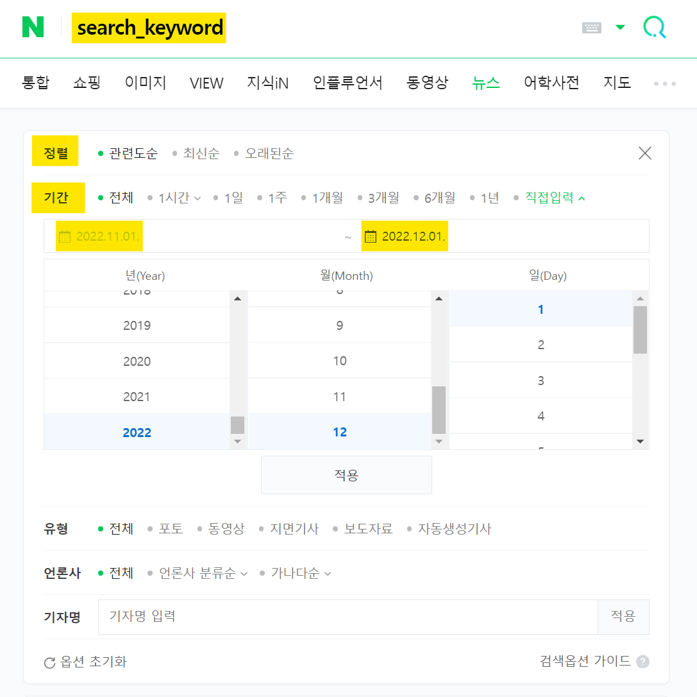

# Naver_News_Crawler

네이버 뉴스 크롤러 (제목, 날짜, 언론사, 기사 내용)

## INPUT

네이버의 뉴스 상세 검색 기능에서 아래 옵션을 선택하여 크롤링합니다.

- **검색 키워드** (search_keyword)
- **기간** : 시작일 (start_day) ~ 종료일 (end_day)
- **정렬** : 0: 관련도순, 1: 최신순, 2: 오래된순

## OUTPUT

특정 기간 내에 검색 키워드로 찾은 뉴스 기사들에 대해 아래 5 가지 내용을 크롤링합니다.

- **뉴스 기사 제목**
- **뉴스 발행일**
- **언론사**
- **뉴스 기사 링크**
- **뉴스 기사 내용**

# 실행법
## 1. CLI 환경

1. `config.yml` 파일의 내용을 원하는대로 바꾸고
2. 터미널(예를 들어, 윈도우 cmd)에서 main.py가 위치한 폴더로 이동한 뒤 (`cd naver_news_crawler`)
3. `python main.py` <- 명령어 실행

## 2. 주피터 노트북 환경

1. `naver_news_crawler.ipynb` 파일을 열고
2. 첫번째 cell 내용을 원하는대로 바꾸고
3. 모든 셀을 순차적으로 실행하면 됩니다.

# 주의 사항

1. 각 뉴스 기사의 내용은 불필요한 내용(e.g. 기자 이름, 광고 등)이 포함되어 있기 때문에 추가적인 전처리가 필요합니다.
   - 이는 신문사마다 뉴스 기사를 싣는 구조가 다르기 때문입니다.
   - 각 뉴스 기사의 내용은 길이가 가장 긴 문단을 본문으로 판단합니다. 따라서 만약 본문 내용보다 광고 내용이 더 많을 경우, 이 크롤러는 광고를 본문으로 판단합니다.
2. 뉴스 기사 내용 크롤링에 셀레니움을 사용하기 때문에 코드 실행 중 크롬 드라이버가 설치되며, 크롤링 속도가 느립니다.
3. 뉴스 기사 내용에 대한 저작권은 해당 뉴스 기사를 작성한 기자 및 언론사에 있습니다. 이 점 반드시 유의하여 주시기 바랍니다.